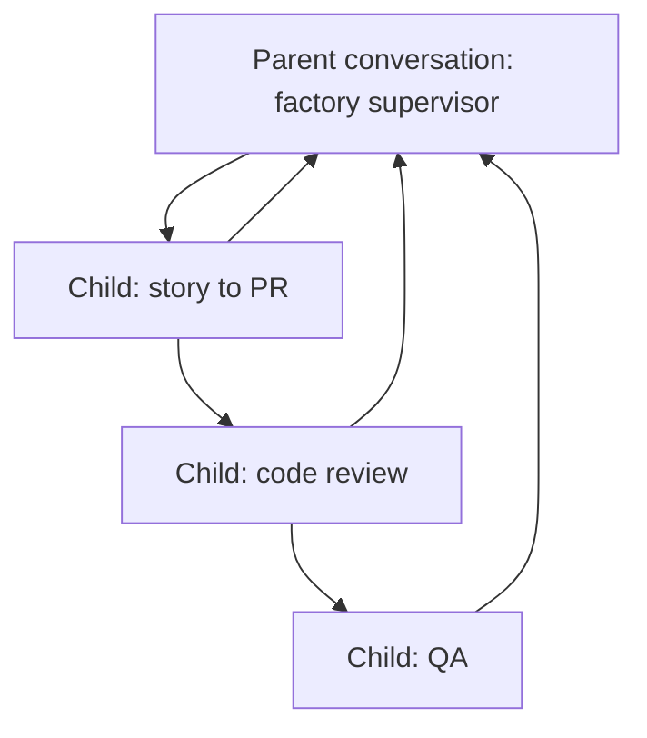

# Agent Canvas SDLC Automation Recipe

This folder contains the Agent Canvas version of the SDLC Automation Demo. It is
structured as a reusable software-factory recipe: one parent conversation acts
as the orchestrator, and delegated child conversations perform bounded SDLC
workcells.

The existing GitHub automation demo is event-driven: a human adds GitHub labels,
and each label creates a separate OpenHands automation run. This Canvas version
does not use labels as the trigger mechanism. It uses one visible parent
conversation as the demo spine. The parent conversation delegates each lifecycle
cell to child Agent Canvas conversations, then gathers their outputs into one
lifecycle report.

For the full customer-facing walkthrough, reproduction steps, and adaptation
points, see `../docs/agent-canvas-dark-factory-demo.md`.

## Conversation Topology



## Files

| Path | Purpose |
| --- | --- |
| `prompts/supervisor.md` | Initial prompt for the one parent conversation. |
| `prompts/workcells/*.md` | Self-contained prompts for delegated child conversations. |
| `../scripts/start_agent_canvas_factory.py` | Starts the parent conversation. |
| `../scripts/run_agent_canvas_factory.py` | Deterministic parent-side orchestrator that starts and monitors child conversations. |
| `../scripts/agent_canvas_delegate.py` | Creates, waits for, and inspects child conversations through the local Agent Canvas API. |
| `../scripts/run_petstore_playwright_qa.py` | Runs the Petstore Playwright evidence flow on an available local port. |
| `../docs/agent-canvas-dark-factory-demo.md` | Customer-facing walkthrough, reproduction recipe, and adaptation guide. |

## Quick Start

Start local Agent Canvas first. The helper defaults to `http://localhost:8000`
and also checks common backend ports.

From the repository root:

```bash
python3 scripts/start_agent_canvas_factory.py \
  --repo . \
  --repo-slug rajshah4/sdlc-automation-github-demo
```

Use a repository path that the local Agent Canvas runtime can read. On macOS,
folders under `Documents`, `Desktop`, or cloud-synced locations may be blocked
by TCC/Full Disk Access policy and can fail with `Operation not permitted` when
the parent tries to run `scripts/run_agent_canvas_factory.py`. A normal
developer checkout under `~/Code` or a temporary checkout under `/private/tmp`
works well for local demos.

To use a different Agent Canvas profile for the code-review child only:

```bash
python3 scripts/start_agent_canvas_factory.py \
  --repo . \
  --repo-slug rajshah4/sdlc-automation-github-demo \
  --code-review-profile Minimax
```

To require Playwright UI evidence from the QA workcell:

```bash
python3 scripts/start_agent_canvas_factory.py \
  --repo . \
  --repo-slug rajshah4/sdlc-automation-github-demo \
  --require-playwright-qa \
  --playwright-node-path /path/to/node_modules
```

The command creates one parent conversation and prints its UI URL. Open that
parent conversation. The supervisor will run `scripts/run_agent_canvas_factory.py`,
which uses `scripts/agent_canvas_delegate.py` inside the repo to create the
child conversations and write run artifacts under:

```text
factory_runs/<run-id>/
```

The launcher also writes `factory_runs/<run-id>/parent.conversation.json` so the
parent conversation ID and URL are explicit in the run artifacts.

For a dry preview of the parent prompt:

```bash
python3 scripts/start_agent_canvas_factory.py --render-only
```

## Safety Boundaries

- The supervisor starts the lifecycle; children do the bounded work.
- Child prompts are self-contained because delegated conversations do not
  inherit hidden parent context.
- GitHub labels may be referenced as historical context from the old demo, but
  they are not used to start, gate, or sequence this Canvas run.
- The default live lifecycle is `story-to-pr`, `code-review`, then `qa`.
- `--require-playwright-qa` makes Playwright evidence mandatory for the QA child.
- The helper forwards encrypted Agent Canvas settings and sets
  `secrets_encrypted: true`; it does not print API keys or LLM secrets.
- The prompts preserve human gates for scope, PR review, merge, deployment,
  production remediation, and secret access.
- The existing GitHub-label automation packages remain intact.

## What This Does Not Change

This folder is additive. It does not modify or replace the existing
`automations/github/` label-triggered demo, and it does not add
environment-specific Jira automation. Trigger adapters can be added separately
after the Canvas recipe is stable.
