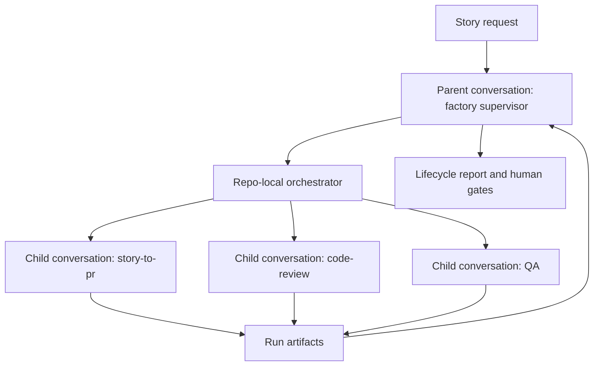

# Agent Canvas Automated Software Factory Recipe

This guide describes a reproducible Agent Canvas recipe for running an SDLC
workflow with one supervisor conversation and delegated workcell conversations.
Use it as a starting point for your own automated software factory: keep the
orchestration pattern, then replace the workcell prompts, repo-specific skills,
validation commands, and external trigger to match your environment.

This demo is additive to the existing GitHub-native SDLC automation demo. The
GitHub-native demo uses GitHub labels as work-cell triggers. This Agent Canvas
version does not use labels to start, gate, or sequence the workflow. Labels can
be passed to a conversation as descriptive metadata, but the control plane is
the parent Agent Canvas conversation.

## What This Demonstrates

The demo shows a multi-agent software factory pattern:

1. A human or external system provides a story request.
2. One parent Agent Canvas conversation becomes the factory supervisor.
3. The supervisor runs a repo-local orchestrator script.
4. The orchestrator delegates bounded work to child conversations.
5. Each child conversation produces an auditable artifact.
6. The supervisor records the lifecycle, child links, gate outcomes, and human
   next steps.

For this repo, the active workcells are:

| Gate | Delegate | Responsibility |
| --- | --- | --- |
| 1 | `story-to-pr` | Understand the story, update the repo, run focused validation, and prepare or update the PR. |
| 2 | `code-review` | Review the branch and report blocking findings, residual risks, and suggested follow-up. |
| 3 | `qa` | Run deterministic tests and, when requested, produce Playwright UI evidence. |

## Architecture



| Layer | Repo Location | Purpose |
| --- | --- | --- |
| Supervisor prompt | `agent-canvas/prompts/supervisor.md` | Tells the parent conversation how to run the factory and summarize the lifecycle. |
| Workcell prompts | `agent-canvas/prompts/workcells/*.md` | Self-contained instructions for each delegated child conversation. |
| Parent launcher | `agent-canvas/scripts/start_agent_canvas_factory.py` | Creates the visible supervisor conversation in local Agent Canvas. |
| Orchestrator | `agent-canvas/scripts/run_agent_canvas_factory.py` | Runs inside the parent conversation, creates child conversations, waits for each gate, and writes run artifacts. |
| Canvas API helper | `agent-canvas/scripts/agent_canvas_delegate.py` | Handles local Agent Canvas API calls, encrypted settings round-trip, profile selection, and polling. |
| QA browser wrapper | `agent-canvas/scripts/run_petstore_playwright_qa.py` | Runs the Petstore Playwright evidence flow on an available local port. |
| Repo-local skills | `skills/sdlc-story`, `skills/sdlc-code-review`, `skills/sdlc-qa` | Domain instructions the child conversations use for story work, review, and QA. |
| Run artifacts | `factory_runs/<run-id>/` | Manifest, child conversation metadata, reports, Playwright evidence, and lifecycle summary. |

The child prompts are intentionally self-contained. Delegated conversations do
not inherit hidden parent context, so each workcell prompt carries the inputs,
success criteria, reporting contract, and safety boundaries needed for that
specific gate.

The Canvas-specific prompts and scripts are packaged under `agent-canvas/` so
teams can review or copy the recipe as one unit.

## Reproduce The Demo

Prerequisites:

- Local Agent Canvas is running.
- `http://localhost:8000/server_info` responds successfully.
- The local Agent Canvas API key exists at
  `$HOME/.openhands/agent-canvas/api-key.txt`, or an equivalent local session
  key is configured.
- The repository is checked out from a path Agent Canvas can read. Mac users
  should review the macOS setup note below before starting a run.

Start the supervisor from the repo root:

```bash
python3 agent-canvas/scripts/start_agent_canvas_factory.py \
  --base http://localhost:8000 \
  --repo "$(pwd)" \
  --repo-slug <github-owner>/<github-repo> \
  --issue-number 88 \
  --run-id demo-agent-canvas-001
```

The command prints the parent conversation URL. Open that URL in Agent Canvas.
That parent conversation is the known supervisor for the run.

In this walkthrough, the external trigger is the operator or demo harness that
runs `agent-canvas/scripts/start_agent_canvas_factory.py` with story metadata. In a customer
environment, the same script is commonly invoked by an automation or webhook
adapter, such as a GitHub issue event, Jira transition, ServiceNow request, or
scheduled polling job. That trigger supplies inputs; the parent Agent Canvas
conversation still owns the lifecycle orchestration.

To use a separate model profile for only the code-review delegate:

```bash
python3 agent-canvas/scripts/start_agent_canvas_factory.py \
  --base http://localhost:8000 \
  --repo "$(pwd)" \
  --repo-slug <github-owner>/<github-repo> \
  --issue-number 88 \
  --run-id demo-agent-canvas-review-profile \
  --code-review-profile Minimax
```

To require Playwright browser evidence in the QA delegate:

```bash
python3 agent-canvas/scripts/start_agent_canvas_factory.py \
  --base http://localhost:8000 \
  --repo "$(pwd)" \
  --repo-slug <github-owner>/<github-repo> \
  --issue-number 88 \
  --run-id demo-agent-canvas-playwright \
  --code-review-profile Minimax \
  --require-playwright-qa \
  --playwright-node-path /path/to/node_modules
```

The Playwright path should point to an existing `node_modules` directory that
contains Playwright for the local environment.

## For Mac Users

macOS can block local Agent Canvas conversations from reading repositories in
privacy-protected folders. If the parent or child conversation reports
`Operation not permitted` when running repo commands, the most common cause is
Full Disk Access policy for a checkout under `Documents`, `Desktop`,
`Downloads`, or a cloud-synced folder.

Recommended local setup on macOS:

- Use a normal developer checkout outside protected folders, such as a repo
  under a dedicated code directory or a temporary checkout under `/private/tmp`.
- If your organization requires the checkout to stay in a protected folder,
  grant Full Disk Access to the terminal or IDE process that launches Agent
  Canvas, then restart that app before rerunning the workflow.
- Do not treat this as a GitHub or Agent Canvas credential problem. The symptom
  is local filesystem access failing before the delegated conversation can run
  repository commands.

## Verify A Run

Each run writes artifacts under:

```text
factory_runs/<run-id>/
```

Useful checks:

```bash
cat factory_runs/<run-id>/children-summary.md
cat factory_runs/<run-id>/lifecycle-report.md
```

Expected artifacts:

| File | Meaning |
| --- | --- |
| `parent.conversation.json` | Parent supervisor conversation ID and URL. |
| `manifest.md` | Run metadata, story request, and planned workcells. |
| `children-summary.md` | Child conversation links and gate statuses. |
| `children.json` | Machine-readable child conversation metadata. |
| `story-to-pr.md` | Story delegate report. |
| `code-review.md` | Code-review delegate report. |
| `qa.md` | QA delegate report. |
| `playwright-artifacts/` | Optional screenshot, video, GIF, and QA report files when Playwright evidence is required. |
| `lifecycle-report.md` | Parent-level lifecycle summary for review and presentation. |

If a delegated child conversation reaches an error, stopped, stuck, or timeout
state before writing its expected report, the orchestrator writes a
`needs-human` artifact at the expected path. That keeps the run auditable even
when a workcell does not pass.

## How To Present It

This recipe is designed to be reproducible, not optimized to finish during a
short live presentation. For customer walkthroughs, use a completed run as the
primary artifact and optionally start a new run to show that the parent
conversation delegates work in real time.

Recommended walkthrough:

1. Open the parent conversation and identify it as the factory supervisor.
2. Show the run manifest and the child conversation links.
3. Open the `story-to-pr` child and show the implementation or PR artifact.
4. Open the `code-review` child and show the independent review result. If a
   separate profile was used, call out that the review delegate used that model
   profile without changing the other delegates.
5. Open the `qa` child and show deterministic test results plus Playwright
   evidence when required.
6. Open the PR and show that the PR body links to evidence and explains the
   lifecycle.
7. End on the lifecycle report and the explicit human gates.

Suggested talk track:

```text
This is a reusable Agent Canvas software-factory recipe. One parent
conversation acts as the orchestrator. It does not do every job itself; it
delegates bounded work to child conversations, waits for evidence, and records
the lifecycle. Customers can keep this structure and replace the workcells,
prompts, validation commands, and trigger source for their own engineering
process.
```

## Adapt The Recipe

Common adaptation points:

| Need | Where To Change It |
| --- | --- |
| Different SDLC stages | Update `ACTIVE_WORK_CELLS` in `agent-canvas/scripts/run_agent_canvas_factory.py` and add a matching prompt under `agent-canvas/prompts/workcells/`. |
| Different story format | Pass `--issue-number`, `--request-title`, and `--request-body`, or wrap the launcher with your own event adapter. |
| Different model per gate | Pass `--code-review-profile`, or extend the runner to accept profile overrides for other workcells. |
| Different validation | Update the repo-local skill and QA prompt for the target app, test runner, or evidence requirement. |
| Different evidence standard | Update `agent-canvas/prompts/workcells/qa.md` and the QA scripts to require screenshots, traces, logs, or deployment checks. |
| External trigger | Have an operator, demo harness, GitHub/Jira automation, webhook adapter, or polling job call the parent launcher with story metadata. Keep orchestration inside the parent workflow. |

An external trigger should provide inputs; it should not become the lifecycle
orchestrator. The reproducible unit is the parent Agent Canvas conversation plus
the repo-local workcell recipe.

## Safety Boundaries

- The existing GitHub-label demo remains intact.
- Labels are not used to trigger, gate, or sequence this Canvas workflow.
- Jira and environment-specific automations are outside this phase and should be
  added as separate adapters once the Canvas recipe is stable.
- The supervisor records blockers and stops before unsafe work when a child
  reports `needs-human`, `fail`, or missing capability.
- Human approval remains required for scope changes, PR review, merge,
  deployment, production remediation, and secret access.

## Local Setup Notes

- If the code-review profile does not exist locally, omit
  `--code-review-profile` or create a matching Agent Canvas profile first.
- If Playwright is required, confirm the `--playwright-node-path` value points
  to a working local `node_modules` directory before starting the run.
- Runs are unattended and can take several minutes or longer, especially when a
  delegate performs browser QA or a separate model profile is used.
